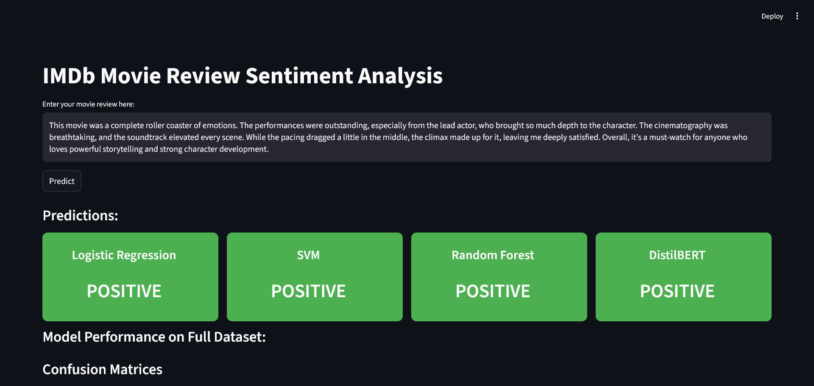
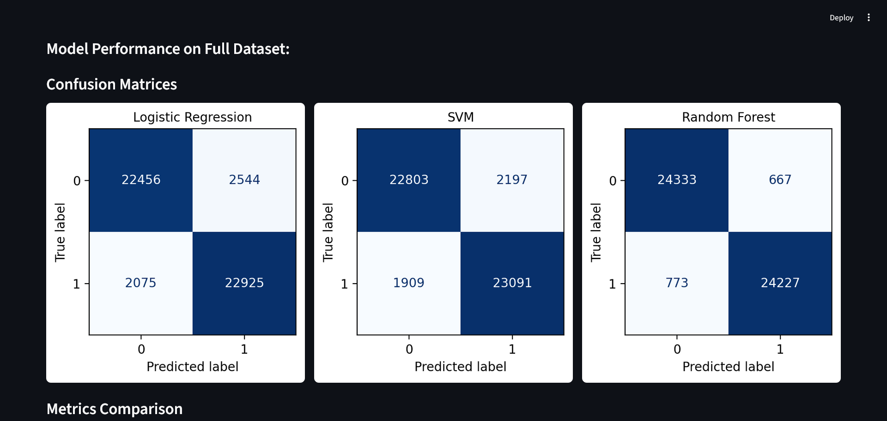
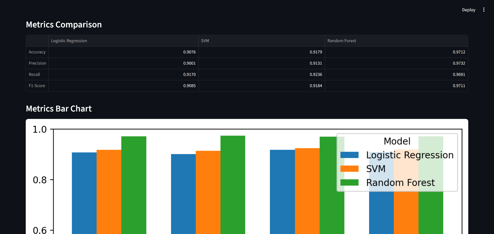

# IMDb Sentiment Analyzer

A machine learning + deep learning project for **sentiment analysis** on the IMDb movie reviews dataset. This project compares **classical ML models** (Logistic Regression, SVM, Random Forest) with a **fine-tuned DistilBERT transformer** model.
The web interface is built with **Streamlit** and hosted on **HuggingFace Spaces**.

## Website Link: 
[Click Here](https://huggingface.co/spaces/Govind-Sankar/IMDb-Sentiment-Analyzer)

## Features

* Train and use **classical ML models** (LogReg, SVM, RF).
* Fine-tuned **DistilBERT model** for state-of-the-art performance.
* Interactive **Streamlit web app** for real-time predictions.
* Model **comparison dashboard** with accuracy, precision, recall, and F1-score.

## Screenshots





## Repository Structure

For full repository check out HuggingFace: [Click Here](https://huggingface.co/Govind-Sankar/IMDb-Sentiment-Analyzer)

```
IMDb-Sentiment-Analyzer/
│── app.py                 # Streamlit app
│── classical_models.py    # Script to train classical models
│── requirements.txt       # Dependencies
│── README.md              # Project documentation
│── IMDB Dataset.csv       # Dataset
│
├── models/
│   ├── logreg_model.pkl
│   ├── svm_model.pkl
│   ├── rf_model.pkl
│   └── vectorizer.pkl
│
├── sentiment_model/       # Fine-tuned DistilBERT 
│   ├── config.json
│   ├── pytorch_model.bin
│   ├── vocab.txt
│   └── ...
|
├── images/                # Screenshots
│   ├── Screenshot_1.png
│   ├── Screenshot_2.png
│   └── Screenshot_3.png
│
└── dilbert.ipynb      # Jupyter notebook for BERT fine-tuning
```

## Models & Results

| Metric    | Logistic Regression | SVM    | Random Forest |
| --------- | ------------------- | ------ | ------------- |
| Accuracy  | 90.76%              | 91.79% | 97.12%        |
| Precision | 90.01%              | 91.31% | 97.32%        |
| Recall    | 91.70%              | 92.36% | 96.91%        |
| F1-Score  | 90.85%              | 91.84% | 97.11%        |

## Installation

1. Clone the repository:

   ```bash
   git lfs install
   git clone https://huggingface.co/Govind-Sankar/IMDb-Sentiment-Analyzer
   cd IMDb-Sentiment-Analyzer
   ```

2. Install dependencies:

   ```bash
   pip install -r requirements.txt
   ```

## Usage

1. Run the Streamlit app:

   ```bash
   streamlit run app.py
   ```

2. Enter a review and see the sentiment prediction.

3. Compare different models on metrics and visualizations.

## Training

* To retrain **classical ML models**:

  ```bash
  python classical_models.py
  ```

  This will regenerate `.pkl` model files in `/models/`.

* To retrain **DistilBERT**:
  Open `dilbert.ipynb` in Jupyter/Colab and run all cells.

## License

This project is licensed under the MIT License. See the [LICENSE](LICENSE) file for details.

```
MIT License

Copyright (c) 2025 Govind Sankar

Permission is hereby granted, free of charge, to any person obtaining a copy
of this software and associated documentation files (the "Software"), to deal
in the Software without restriction, including without limitation the rights
to use, copy, modify, merge, publish, distribute, sublicense, and/or sell
copies of the Software, and to permit persons to whom the Software is
furnished to do so, subject to the following conditions:

The above copyright notice and this permission notice shall be included in all
copies or substantial portions of the Software.

THE SOFTWARE IS PROVIDED "AS IS", WITHOUT WARRANTY OF ANY KIND, EXPRESS OR
IMPLIED, INCLUDING BUT NOT LIMITED TO THE WARRANTIES OF MERCHANTABILITY,
FITNESS FOR A PARTICULAR PURPOSE AND NONINFRINGEMENT. IN NO EVENT SHALL THE
AUTHORS OR COPYRIGHT HOLDERS BE LIABLE FOR ANY CLAIM, DAMAGES OR OTHER
LIABILITY, WHETHER IN AN ACTION OF CONTRACT, TORT OR OTHERWISE, ARISING FROM,
OUT OF OR IN CONNECTION WITH THE SOFTWARE OR THE USE OR OTHER DEALINGS IN THE
SOFTWARE.
```